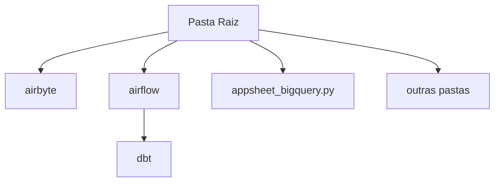

# Modern Stacks with BigQuery

## Project layout

```mermaid
graph TD;
    A[Pasta Raiz]
    A --> B[airbyte]
    A --> C[airflow]
    C --> D[dbt]
    A --> E[appsheet_bigquery.py]
    A --> F[outras pastas]

```

## Funções

#####AppSheet to BigQuery

nome da função: `integrate_appsheet_to_bigquery`

::: appsheet_bigquery.integrate_appsheet_to_bigquery
